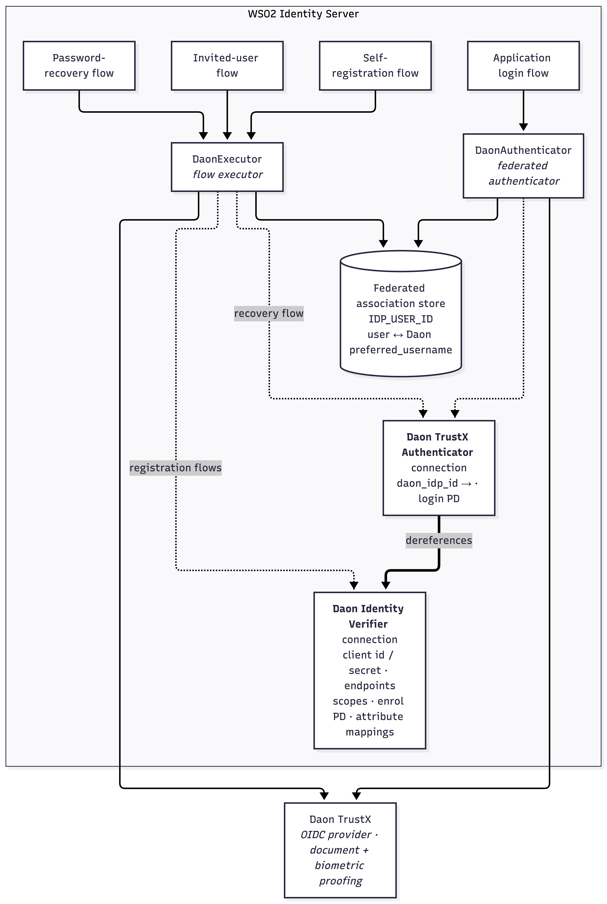
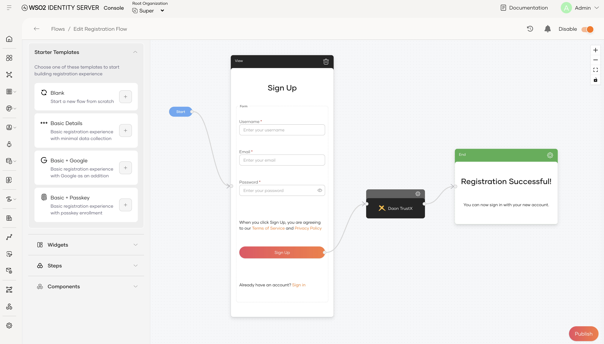
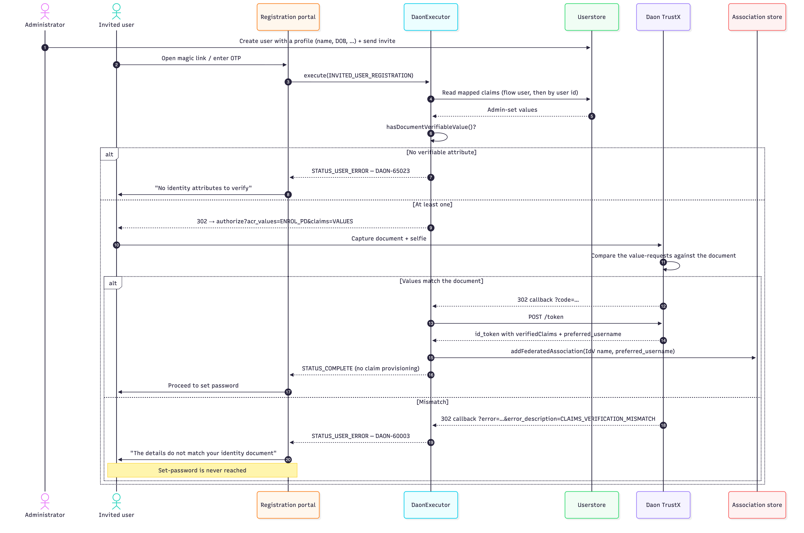
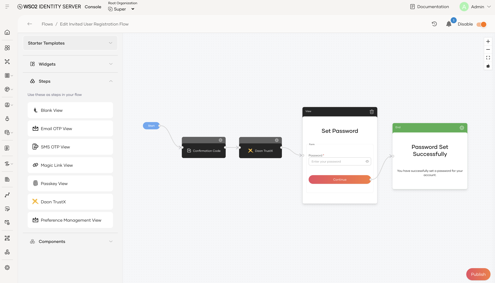
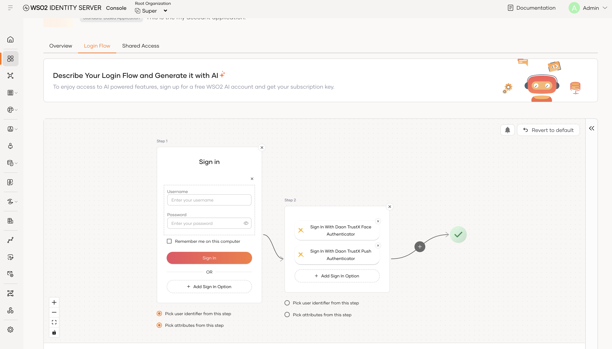
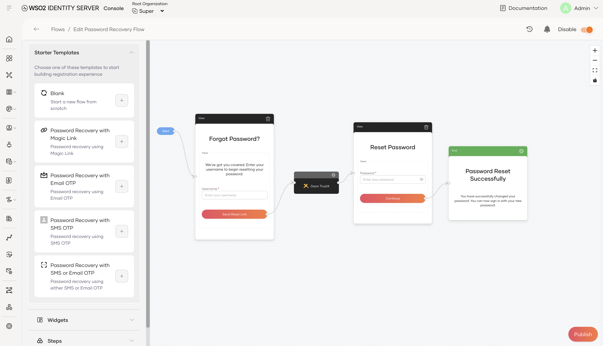
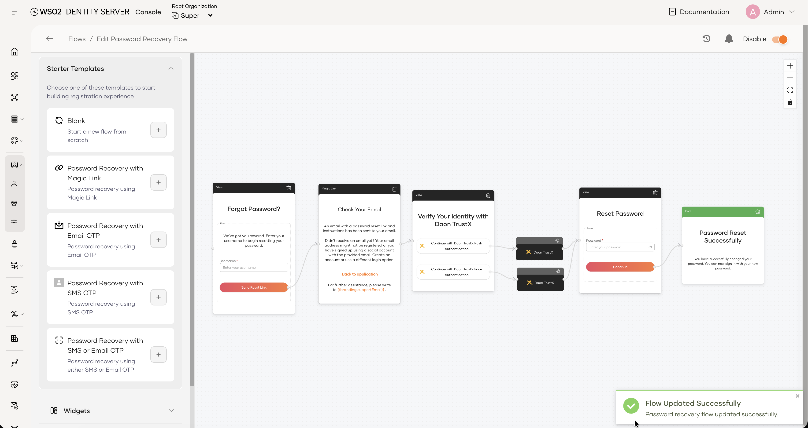

# Supported Use Cases

The connector supports **four** distinct runtime paths, each a flow an administrator wires up in the
console.

| # | Use case | Flow type | Connection to add | Process definition | Runs as |
|---|---|---|---|---|---|
| 1 | [Self-registration with verified onboarding](#1-self-registration) | `REGISTRATION` | **Identity Verifier** | Enrol PD | `DaonExecutor` |
| 2 | [Invited-user registration with profile validation](#2-invited-user-registration) | `INVITED_USER_REGISTRATION` | **Identity Verifier** | Enrol PD | `DaonExecutor` |
| 3 | [Step-up identity verification at login](#3-login-re-verification) | Login | **Authenticator** (login) | Login PD | `DaonAuthenticator` |
| 4 | [Identity verification for password recovery](#4-password-recovery) | `PASSWORD_RECOVERY` | **Authenticator** (login) | Login PD | `DaonExecutor` |

### Constraints that apply to every flow

* **Only three flow types are supported by the executor** — `REGISTRATION`,
  `INVITED_USER_REGISTRATION` and `PASSWORD_RECOVERY`. The node does not appear in any other flow
  composer.
* **The result arrives on the redirect only.** There is no webhook receiver and no polling, so a Daon
  process that completes out-of-band after the redirect cannot be picked up.
* **No OIDC logout / single logout** against Daon.
* **Token validation is delegated.** The connector reads claims out of the ID token; signature, issuer
  and audience validation are done by the stock WSO2 OIDC authenticator and executor it extends.
  Nothing Daon-specific is validated beyond the trust framework and the subject match.

---

## How the pieces fit together

**The key relationship:** a login connection never holds credentials of its own. It dereferences the
Identity Verifier connection it points at for the OIDC client, the endpoints, the scopes, the enrol
PD and the attribute mappings — and the enrolment it reads and writes is recorded against **the
referenced connection**. That is what lets several login connections share one enrolment.

> ### ⚠️ Enrolments are scoped to one Identity Verifier connection
>
> An enrolment belongs to the Identity Verifier connection it was made through — **not** to the user
> and not to the organization. A user enrolled through one Identity Verifier can only be verified by
> login connections that reference **that same** Identity Verifier.
>
> If you deploy several Identity Verifier connections, a user who enrolled through Verifier A is
> "not enrolled" as far as any login connection pointing at Verifier B is concerned: the login step
> fails with `DAON-60001` and the recovery flow fails the same way. There is no sharing, migration or
> fallback between verifiers, and a user cannot be enrolled through B without going through an
> enrolment flow again.
> 

---

## 1. Self-registration

**Goal:** onboard a brand-new user whose profile is populated from a verified identity document
rather than from what they typed.

**Setup:** add the **Daon TrustX Identity Verifier** connection's executor node to the
self-registration flow, **after** the attribute-collection step and **before** the password step.

Placement matters because of what gets sent to Daon for comparison: an attribute is sent as a
value-request only if it is **both mapped on the Identity Verifier connection and already collected**
by the time the Daon node runs. A mapped attribute the flow has not collected yet is merely
*requested* (Daon returns it from the document); a collected attribute that is not mapped is never
sent at all. If the connection carries no attribute mappings, no `claims` parameter is sent.

### What happens

1. The executor builds an `authorize` request carrying `acr_values=<enrol PD>` and a `claims`
   parameter requesting `verified_claims` under trust framework `daon-identify-1`.
2. The **mapped** Daon claims make up the requested set. Each one the flow has **already collected**
   goes in as a `{"value": "..."}` **value-request** — that is what Daon compares against the
   document; each one it has not goes in as `null`, asking Daon to return it. The document claims
   (`document_type`, `document_classification`, `document_date_of_expiry`, `document_number`,
   `document_personal_number`) are always appended, and `family_name_and_given_name` is added
   automatically whenever `given_name` or `family_name` is mapped.
3. The user completes the Daon journey — document capture, selfie, liveness.
4. On the callback the executor exchanges the code, reads `verifiedClaims.claims` out of the ID
   token, checks the trust framework, and **overwrites** the collected claims with the values from
   the document.
5. The Daon `preferred_username` is recorded as a federated association on the new user.

### Flow

### Limitations

* **Document values overwrite what the user typed.** Any collected claim that is also mapped and
  returned by Daon is replaced by the document value. That is the point of the flow, but it means a
  user cannot correct a mis-read document field during registration.
* **Only this flow provisions claims.** The invited-user flow validates without writing, and password
  recovery reads nothing.

---

## 2. Invited-user registration

**Goal:** an administrator creates the account and fills in the profile; Daon proves the person
holding the invitation is the person the profile describes.

**Setup:** add the **Daon TrustX Identity Verifier** connection's executor node to the invited-user
registration flow, **before the set-password step**. Only a successful verification advances.

### What is different from self-registration

* The value-requests come from the **admin-set profile** — read from the flow user, falling back to
  the userstore by user id — not from anything the user just typed.
* Verification is **server-side, by Daon**. The connector does no client-side re-comparison of the
  returned claims; a mismatch arrives as `CLAIMS_VERIFICATION_MISMATCH` in the callback's
  `error_description` and the step fails with `DAON-60003`.
* The step **refuses to run** if none of the mapped-and-populated attributes is document-verifiable
  (`DAON-65023`), rather than accepting a verification that proves nothing about the profile. The
  document-verifiable set is `given_name`, `family_name`, `family_name_and_given_name`, `birthdate`,
  `document_number`, `document_personal_number`.
* **No claims are provisioned.** The admin's profile stands as authored; Daon only validates it.

### Flow

### Limitations

* **Validation only — no provisioning.** The admin-set profile stands as authored; Daon confirms it
  matches the document but nothing is written back to the user.
* **The comparison is server-side and opaque.** The connector never re-compares the returned claims
  against the profile — that happens inside Daon. A failure is only ever visible as the
  `CLAIMS_VERIFICATION_MISMATCH` token in the callback's `error_description` (`DAON-60003`); the
  connector cannot say *which* attribute failed.
* **At least one document-verifiable attribute is mandatory**, and the set is fixed in code:
  `given_name`, `family_name`, `family_name_and_given_name`, `birthdate`, `document_number`,
  `document_personal_number`. Email, phone or address can be requested but do not, on their own, let
  the step run (`DAON-65023`).

---

## 3. Login re-verification

**Goal:** step up an already-enrolled user with a live biometric check before they reach a sensitive
application.

**Setup:** add a **Daon TrustX Authenticator** (login) connection to the application's Login Flow as
a step **after** the user has been identified — typically step 2, after username & password. The
connector needs a last-authenticated user to resolve the association from.

### What happens

The step resolves the user's Daon subject from the association keyed on the **referenced** Identity
Verifier connection, sends it as `login_hint` with `acr_values=<login PD>`, and on the callback
asserts that the `preferred_username` Daon returned is the one it asked for. That last check matters:
`login_hint` is only a hint per OIDC, so without it anyone who verifies their *own* enrolled identity
would satisfy the step for *any* account.

A user with **no** association is not enrolled. The step fails with `DAON-60001` and the user is sent
to the login retry page — enrolment happens through a registration flow.

### Flow

### Limitations

* **The step cannot be the first factor.** It resolves the user from the last authenticated user in
  the context, so it must run after the user is identified. It is a step-up mechanism, not a login
  mechanism, and the Daon user is never JIT-provisioned as a federated identity.
* **A login step never enrols on its own.** An unenrolled user fails with `DAON-60001`. Enrolment
  happens through a registration flow.
* **The enrolment must be on the referenced Identity Verifier.** A user enrolled through a *different*
  Identity Verifier connection reads as not enrolled here — see
  [the scoping warning above](#how-the-pieces-fit-together).
* **Verification has no lifetime, level or timestamp.** The connector records that a user is enrolled
  and nothing more — no expiry, no re-verification interval, no assurance level, no record of when or
  against which document type the verification happened. A policy such as "verified within the last
  12 months" has to be enforced outside the connector.

---

## 4. Password recovery

**Goal:** prove the person resetting the password is the enrolled account holder, with a face or
push-notification check instead of (or in addition to) an emailed link.

**Setup:** add a **Daon TrustX Authenticator** (login) connection's executor node to the
password-recovery flow.

### What happens

The executor resolves the account's Daon subject from the association, sends it as `login_hint` with
`acr_values=<login PD>` — **no claims request** — and on the callback compares the returned
`preferred_username` against the one it asked for. No claims are read or provisioned; a recovery is
an identity check, not a profile refresh. An account with no association fails immediately with
`DAON-60001` (the request is never sent to Daon).

### Flow

### Limitations

* **Identity check only.** No claims are read or provisioned, and the `verifiedClaims` block is not
  required on the recovery ID token.
* **Unenrolled accounts fail immediately** with `DAON-60001` — the request is never sent to Daon — as
  do accounts enrolled through a different Identity Verifier connection.

A recovery flow can also offer more than one Daon login connection — here the user picks push or
face verification after the emailed link, and each option routes to its own Daon TrustX node:

